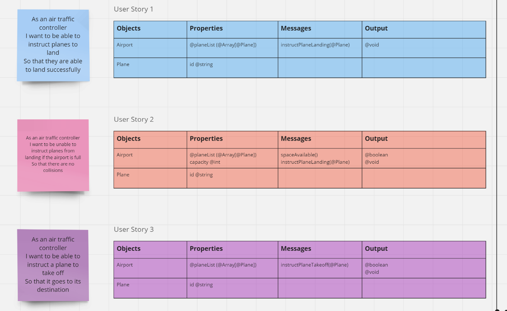
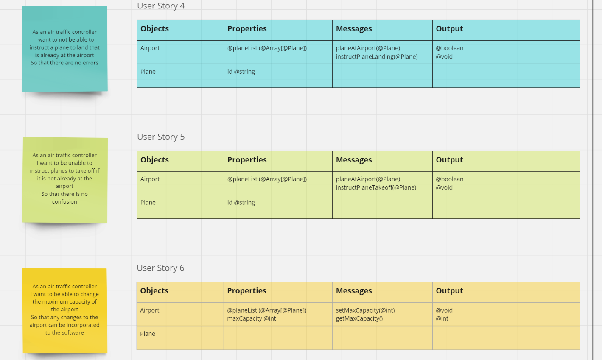

# Domain Models and Test Plan

### Client requirements converted into user stories

### Each user story then has a corresponding domain model showing the properties, messages and output required for the specific functionality to be implemented.

