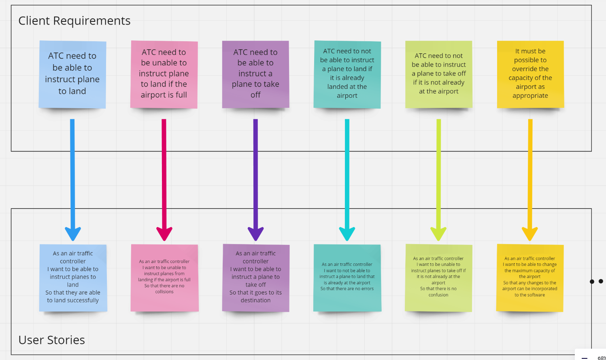

# Domain Models and Test Plan

### Kanban board showing overall breakdown of tasks to be completed.

### Client requirements converted into user stories.

### Each user story then has a corresponding domain model showing the properties, messages and output required for the specific functionality to be implemented.

### Kanban board for setting out the tests to be used during the test-driven development of the software.

### Full detials of the tests for each user story:
---
*User Story 1:*
As an air traffic controller
I want to be able to instruct planes to land
So that they are able to land successfully

* Test that planeList.length increases by 1 after performing instructPlaneLanding()
* Test that planeList includes the new plane after performing instructPlaneLanding()
* Test that the new plane is added for a airport already holding some planes
* Test that a null 'plane' can not be landed at the airport 
---
*User Story 2*
As an air traffic controller
I want to be unable to instruct planes from landing if the airport is full
So that there are no collisions

* Test that spaceAvailable() returns false if planeList is longer than  the capacity
* Test that spaceAvailable() returns false if planeList is equal to the capacity
* Test that spaceAvailable() returns true if planeList is shorter than the capacity
* Test that I can land a plane if spaceAvailable is true
* Test that I am not able to land a plane if spaceAvailable is false
---
*User Story 3*
As an air traffic controller
I want to be able to instruct a plane to take off
So that it goes to its destination

* Test that instructing a plane to take off reduces length of planeList() by 1
* Test that after instructing a plane to leave, that plane is no longer in the planeList
* Test that we can instruct a plane to leave if there are multiple planes in the airport to start with
---
*User Story 4*
As an air traffic controller
I want to not be able to instruct a plane to land that is already at the airport
So that there are no errors

* Test that planeAtAirport(plane) returns true if the plane is at the airport
* Test that planeAtAirport(plane) returns false for an empty airport
* Test that planeAtAirport(plane) returns false if the plane is not at the airport even if there are other planes already
* Test that if a plane is already at an airport then we can't instruct the plane to land
* Test that if a plane is not already at an airport then we can instruct the plane to land
---
*User Story 5*
As an air traffic controller
I want to be unable to instruct planes to take off if it is not already at the airport
So that there is no confusion

* Test that if a plane is the only plane at the airport then we can instruct it to leave
* Test that if a plane is one of many planes at the airport we can instruct it to leave
* Test that we can't instruct a plane to leave if they airport is empty
* Test that if there are planes in the airport, but not the one we instruct to leave, the plane can not leave
---
*User Story 6*
As an air traffic controller
I want to be able to change the maximum capacity of the airport
So that any changes to the airport can be incorporated to the software

* Test that after using setMaxCapacity(), the airport's capacity has changed to the inputted capacity
* Test that increasing the capacity does not affect the number of planes already in the airport
* Test that we are unable to reduce the capacity below the number of planes currently in the airport
* Test that we are able to reduce the capacity to exactly the number of planes currently in the airport
* Test that if we reduce the capacity to exactly the number of planes in the airport, spaceAvailable() changes from true to false